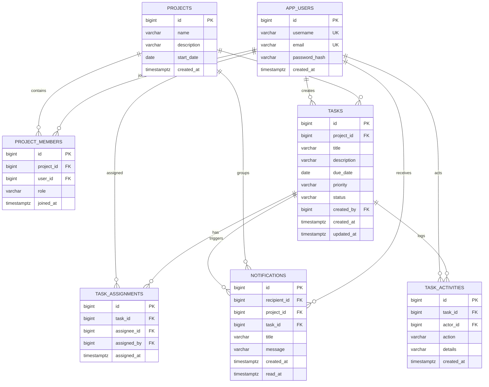

# Schéma de base de données ProjectManagementTool

```mermaid
erDiagram
    APP_USERS ||--o{ PROJECT_MEMBERS : joins
    PROJECTS ||--o{ PROJECT_MEMBERS : contains
    PROJECTS ||--o{ TASKS : contains
    APP_USERS ||--o{ TASKS : creates
    TASKS ||--o{ TASK_ASSIGNMENTS : has
    APP_USERS ||--o{ TASK_ASSIGNMENTS : assigned
    APP_USERS ||--o{ NOTIFICATIONS : receives
    PROJECTS ||--o{ NOTIFICATIONS : groups
    TASKS ||--o{ NOTIFICATIONS : triggers
    TASKS ||--o{ TASK_ACTIVITIES : logs
    APP_USERS ||--o{ TASK_ACTIVITIES : acts

    APP_USERS {
        bigint id PK
        varchar username UK
        varchar email UK
        varchar password_hash
        timestamptz created_at
    }

    PROJECTS {
        bigint id PK
        varchar name
        varchar description
        date start_date
        timestamptz created_at
    }

    PROJECT_MEMBERS {
        bigint id PK
        bigint project_id FK
        bigint user_id FK
        varchar role
        timestamptz joined_at
    }

    TASKS {
        bigint id PK
        bigint project_id FK
        varchar title
        varchar description
        date due_date
        varchar priority
        varchar status
        bigint created_by FK
        timestamptz created_at
        timestamptz updated_at
    }

    TASK_ASSIGNMENTS {
        bigint id PK
        bigint task_id FK
        bigint assignee_id FK
        bigint assigned_by FK
        timestamptz assigned_at
    }

    NOTIFICATIONS {
        bigint id PK
        bigint recipient_id FK
        bigint project_id FK
        bigint task_id FK
        varchar title
        varchar message
        timestamptz created_at
        timestamptz read_at
    }

    TASK_ACTIVITIES {
        bigint id PK
        bigint task_id FK
        bigint actor_id FK
        varchar action
        varchar details
        timestamptz created_at
    }
```

Le script executable est disponible dans `database/schema.sql`. Les donnees de demonstration sont dans `database/test-data.sql`.
